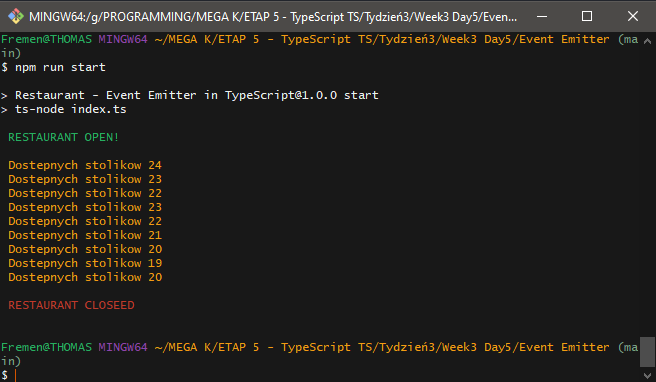

# Restaurant---Event-Emitter-in-TypeScript

## It's excercise which have a goal to train refactoring from JavaScript to TypeScript. Excercise from previous modules of MEGA-K course with continous improvement.

